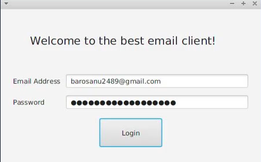
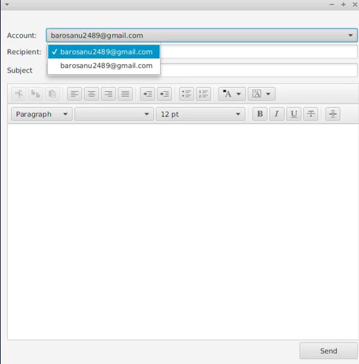
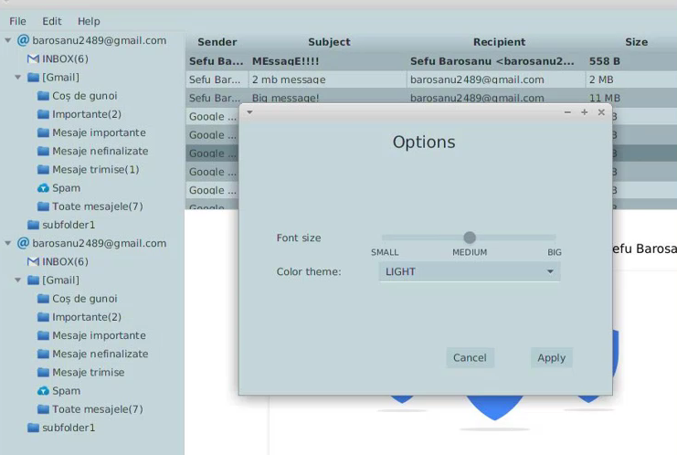
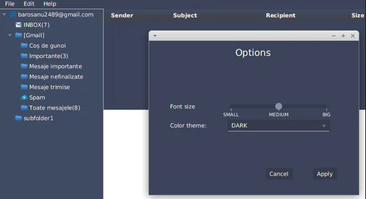

# EmailApplication

A lightweight desktop email client built with Java, JavaFX and Maven. The app demonstrates a simple JavaFX UI (login, inbox, compose, message details and settings), database-backed account storage, themes and a small splash screen.

## Key technologies

- Java 22
- Maven wrapper (included)
- JavaFX 22 (controls, fxml, web)
- MySQL (via `mysql-connector-java`)
- Spring Security crypto (for basic password encryption utilities)

## Features

- Splash screen and main window
- Login and account management (saved accounts stored in a MySQL table)
- Compose and send messages (email sending logic present in project)
- Message viewer/details window
- Theme support (light/dark/default) and font sizes
- Options / About windows

## Prerequisites

- JDK 22 installed and JAVA_HOME set
- Git (optional)
- Internet connection to download Maven dependencies the first time
- A MySQL instance (or change `DatabaseHelper` to use another database)

Note: The project includes the Maven wrapper (`mvnw` / `mvnw.cmd`), so you don't need Maven pre-installed.

## Quick start (Windows PowerShell)

1. Open a PowerShell in the project root (where `mvnw.cmd` and `pom.xml` are located).
2. Build and run using the JavaFX Maven plugin via the wrapper:

```powershell
.\mvnw.cmd clean javafx:run
```

If you have Maven installed you can run:

```powershell
mvn clean javafx:run
```

Alternatively, import the project into an IDE (IntelliJ IDEA, Eclipse) as a Maven project and run the `com.example.emailapp.emailApplication` main class.

## Configuration

- Database: The project currently reads DB settings from `DatabaseHelper.java` (see `URL`, `USER`, `PASSWORD`). Before running, update these fields to match your MySQL server and credentials. The default values in the repository are placeholders and should be changed.
- Encryption key: `DatabaseHelper` contains a `SECRET_KEY` constant used for AES encryption; replace this with a secure random key in production.

Recommended DB table (example):

```sql
CREATE DATABASE foremailaccounts;
USE foremailaccounts;

CREATE TABLE email_accounts (
	email VARCHAR(255) PRIMARY KEY,
	password TEXT
);
```

Security note: Do NOT commit real credentials or secret keys to source control. Consider reading DB credentials from environment variables or a config file outside version control.

## Project structure (important files)

- `src/main/java/com/example/emailapp/` — application code and controllers
	- `emailApplication.java` — JavaFX Application (splash then launches the UI)
	- `DatabaseHelper.java` — helper for saving/retrieving saved accounts (MySQL)
	- `EmailManager`, `EmailSenderService`, `FetchFolderService`, etc. — core email logic
- `src/main/resources/com/example/emailapp/` — FXML, CSS, icons
	- `*.fxml` — UI layouts
	- `css/` — themes and font size styles (themeDefault.css, themeDark.css, themeLight.css, fontSmall/Medium/Big)

## Troubleshooting

- JavaFX errors: Make sure JDK 22 is installed and that the `javafx-*` dependencies are available. The `javafx-maven-plugin` included in `pom.xml` provides a straightforward run configuration.
- Database connection issues: Check the URL in `DatabaseHelper.java` and ensure your MySQL server is reachable and the user has privileges.
- Module-related errors: The `pom.xml` uses the plugin with a module-style main class entry. IDEs may need module-aware run configs or to run via Maven wrapper.

## Screenshots

Below are screenshots currently saved in `docs/screenshots/` (displayed at the repository — click to view full size):

- Main window
	

- Sidebar
	

- Login window
	

- Compose / Send
	

- Light theme
	

- Dark theme
	

If you'd like a different ordering, captions, or additional screenshots (for example `options-window.png` or a larger banner), add the images to `docs/screenshots/` and update this section or tell me and I can add them for you.

Tip: Use 1280x720 (or similar) resolution screenshots for good readability on GitHub. Commit them under `docs/screenshots/` and they will render automatically.

## Contributing

1. Fork the project
2. Create a feature branch
3. Make changes and run `mvnw clean javafx:run` to verify
4. Create a pull request with a clear description

If you add features that require configuration (for example different DB backends), include clear README instructions and sample config templates (e.g., `.env.example`).

## License

This repository does not include a license file. Add a `LICENSE` file to make the terms explicit (MIT, Apache-2.0, etc.).

## Contact

If you want help running the project or adding features, open an issue describing the problem and your environment (OS, JDK version, exact command used).

---

Generated README — edit as needed to add screenshots, badges, or project badges.
